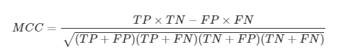

### a mixed approach for urban flood prediction using ML and GIS

---

- `GIS`

        Geographic information system :

                지리정보를 컴퓨터 데이터로 변환해서 효율적으로 사용하기 위한 정보시스템 

---

- `Matthew's Correlation Coefficient (MCC)`

        

            정답 벡터와 예측 벡터가 얼마나 유사한지 나타내는 피어슨 상관계수 
